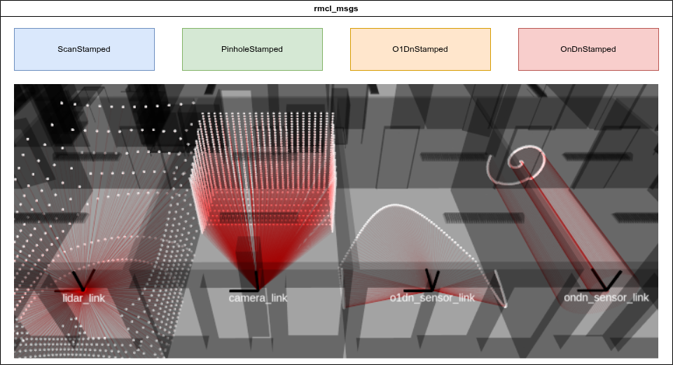

# RMCL Conversions

So, well-known message types such as `sensor_msgs/PointCloud2` or `sensor_msgs/LaserScan` has to be converted to one of RMCL's messages first, before starting the RMCL nodes.

## RMCL Messages

The localization approaches in RMCL seek to support four main messages that include sensor model and data: 

|     |      |
|:---:|:-----|
| `ScanStamped` | This message describes a spinning range sensor, such as a Velodyne, by describing both the vertical and horizontal directions by fixed angle increments. This message is analogously desgined to the 2D counterpart [`sensor_msgs/LaserScan`](https://github.com/ros2/common_interfaces/blob/jazzy/sensor_msgs/msg/LaserScan.msg). |
| `PinholeStamped` | A `ScanStamped` message describes a range sensor that can be modeled by Pinhole projection.  |
| `O1DnStamped` | A more flexible description of a range sensor consisting of one measurement origin and a list of arbitrary measurement directions. |
| `OnDnStamped` | Same as O1DnStamped but you can give every measurement direction an own origin.  |

For more details how the actual fields of the messages look like we refer to the message definitions or the docs of the [rmagine](https://github.com/uos/rmagine) library.

## Need for Conversion

We intentionally constrain the RMCL tools to accept only `rmcl_msgs` as input, because many common range data formats omit critical details of the measurement process that are essential for accurate robot localization.

A typical example is the `sensor_msgs/PointCloud2` message, which is the standard output format used by many LiDAR manufacturers' ROS drivers. This type of point cloud contains Cartesian coordinates representing the locations (relative to the sensor origin) where surfaces were detected.
However, when no surface is detected, one usually either omits the point entirely or fills the corresponding entry with `NaN` or `Inf` values to preserve the scan order. The issue here is that from a `NaN` or `Inf` coordinate alone, we cannot infer the actual direction in which the sensor was attempting to measure.

One might assume this is unimportant, as after all the point is invalid. But this assumption overlooks a key fact: when a LiDAR beam doesn't hit anything, it is actually reporting that a large volume of space is unoccupied. In this case, the LiDAR effectively measures the entire possible range as free space.

To preserve this valuable information, we provide message types that retain such properties. Once the data is converted into `rmcl_msgs`, we can be confident that no critical information about the scanning process is lost.
It is now the responsibility of robotics engineers to ensure their sensor data is correctly transformed into the appropriate `rmcl_msgs`. 

## Shipped Conversion Nodes

For most commonly used message formats, we provide conversion nodes to assist with this task, which are described in the following subsections.

All nodes can be configured at runtime using `rqt_reconfigure`.
Here it helps to activate the `debug_cloud` parameter to see if the conversion went as expected.

### PC2 to O1Dn

**Note**: This node omits the information about the actual scanning pattern.

### PC2 to Scan

When the scanning pattern can be described using a spherical model, this node handles the conversion for you. The scanner model is defined via ROS parameters, creating a virtual pixel matrix in spherical coordinates.

The input point cloud is then used to determine which pixels have valid range measurements. Pixels without corresponding points are marked as `Inf`, or a value that is out of the valid range.

### Scan to Scan

This node converts a `sensor_msgs/LaserScan` message into a `rmcl_msgs/ScanStamped`. Since `sensor_msgs/LaserScan` fully describes the sensor's measurement process, no additional parameters are required for the conversion.
However, optional parameters are available to pre-filter the data, for example, to reduce the density of the scan by making it more sparse.

