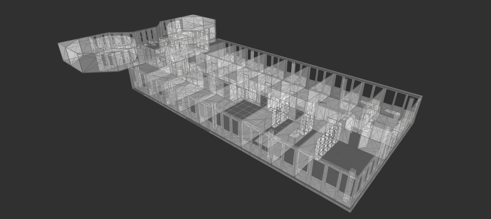
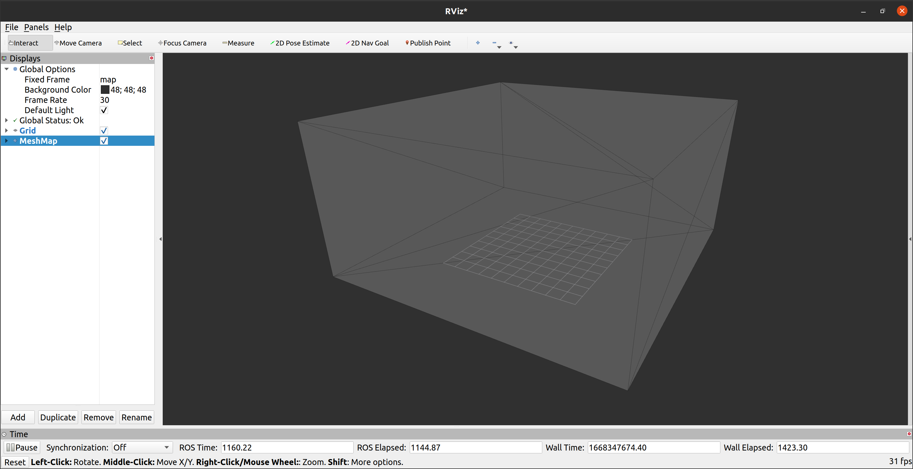
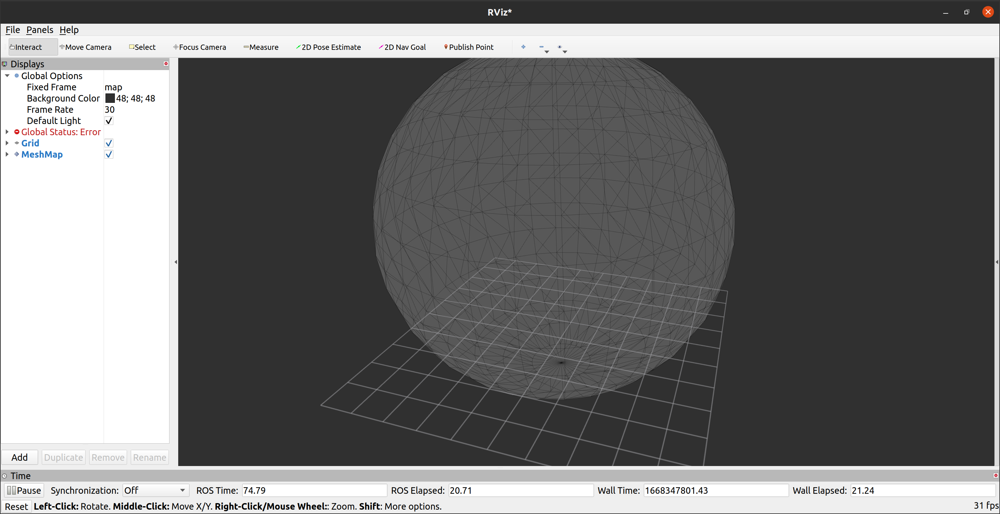
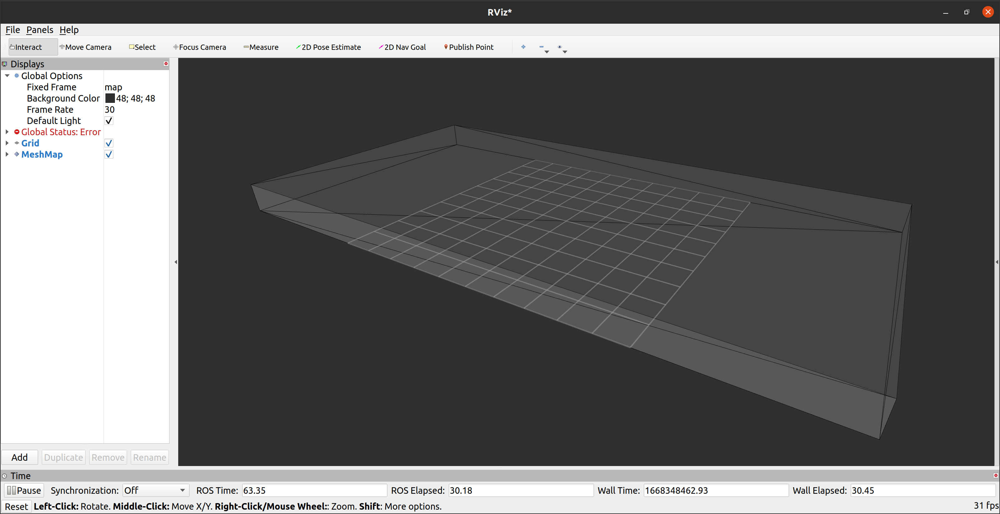

# rmcl_examples_maps

This package holds all the 3D maps used in [rmcl_examples](/).


### Visualize a map in RViz

Check which maps are available:

```console
ros2 launch rmcl_examples_maps show_map.launch -s
```

The `map` entry lists all the available maps of which one can be visualized via:

```console
ros2 launch rmcl_examples_maps show_map.launch map:=avz
```

This opens an RViz window like this:



## What's in here?

Each map corresponds to a specific environment. These environments can also be simulated using the [rmcl_examples_sim](/rmcl_examples_sim/) package.  
That package uses clones of these maps to simulate the environment and spawn a robot inside it.

This creates an interesting (and rare) setup: the simulated environment matches the map exactly — something you don’t get in the real world.

The worlds `cube`, `sphere`, `cylinder`, and `tray` and the corresponding maps look as follows:

|  Gazebo  |  Map (RViz)  |
|:--------:|:------:|
|  |  |
|  |  |
|  |  |
|  |  |

## Future Experiments (Not Implemented Yet)

Once the basics work, you can start playing around:

1. Remove some parts of the map geometry (e.g., in Blender)
2. Remove parts of the simulated world (also in Blender)
3. Add dynamic objects in the simulation
4. Add noise to the map's vertices

