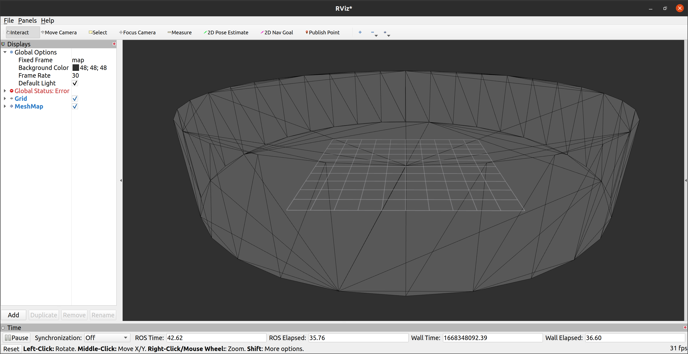

# rmcl_examples_maps

This package holds all the 3D maps used in [rmcl_examples](/).


### Visualize a map in RViz

Check which maps are available:

```console
ros2 launch rmcl_examples_maps show_map.launch -s
```

The `map` entry lists all the available maps of which one can be visualized via:

```console
ros2 launch rmcl_examples_maps show_map.launch map:=avz
```

This opens an RViz window like this:


## What's in here?

Each map corresponds to a specific environment. These environments can also be simulated using the [rmcl_examples_sim](/rmcl_examples_sim/) package.  
That package uses clones of these maps to simulate the environment and spawn a robot inside it.

This creates an interesting (and rare) setup: the simulated environment matches the map exactly — something you don’t get in the real world.

The worlds `cube`, `sphere`, `cylinder`, and `tray` and the corresponding maps look as follows:

|  Gazebo  |  Map (RViz)  |
|:--------:|:------:|
|  |  |
|  |  |
|  |  |
|  |  |

All environments are designed to benchmark localization algorithms, each posing a unique and challenging problem. Most of these environments are intentionally constructed to prevent unique localization solutions. Instead, the objective is to achieve the best possible reduction of the belief state informed by the sensor data. A localization method is considered to fail if it produces a single definitive solution when multiple locations are equally probable. The following table briefly summarize the best possible localization outcome for a robot equipped with motor encoders, an IMU and a 3D LiDAR:

|  World Name | Best possible localization |
|:------------|:-------------------------------------------------------|
|  `cube`     | 4 modes in your belief state probability distribution  |
|  `sphere`   | Equal probabilty for every pose located on the surface |
|  `cylinder` | Circular probability distribution |
|  `tray`     | Similar to cube but rectengular: 2 most probable modes. Dependent on the system and sensor noise, two more slightly less probable modes could exist. |
|  `corridor` | State: anywhere in the center of the corridor. Belief state: same probability everywhere in the center of the corridor |
|  `trays`    | 3x3 grid of `tray` model. Same most probable modes as for the `tray` environment but symmetrically distributed over a 3x3 grid. |
|  `avz`      | Old office floor of Osnabrück University in the AVZ building. Real world sample, still many ambiguities such as same sized rooms. |

## Future Experiments (Not Implemented Yet)

Once the basics work, you can start playing around:

1. Remove some parts of the map geometry (e.g., in Blender)
2. Remove parts of the simulated world (also in Blender)
3. Add dynamic objects in the simulation
4. Add noise to the map's vertices

