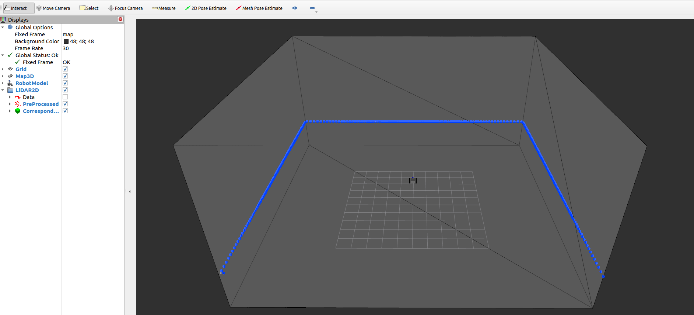
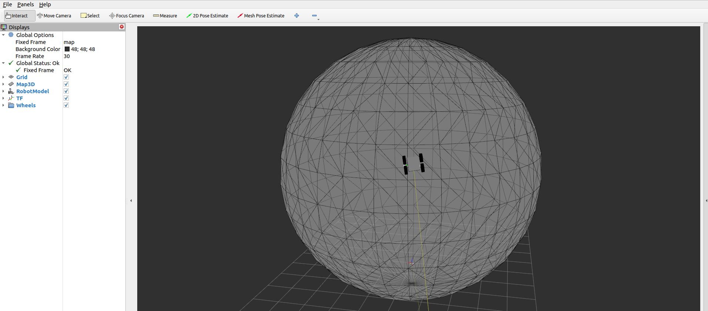

# MICP-L Overview

Three sensors, four wheels, and many worlds.


See all options:
```console
ros2 launch rmcl_examples_sim start_robot_launch.py -s
```

In the following example we vary the three parameters `lidar3d`, `lidar2d`, `rgbd_camera` to enable certain sensors and `map` to select a world.

First, we want to see how each sensor data looks like. So we enable every sensor and select, eg, the `avz` world:

```console
ros2 launch rmcl_examples_sim start_robot_launch.py lidar3d:=True lidar2d:=True rgbd_camera:=True map:=avz
```


In the opened window of Gazebo, you see a simple differential drive robot that represents a virtual clone of a [Ceres](https://github.com/uos/ceres_robot) robot (Volksbot platform). The robot is spawned in the AVZ world. This world also exists in reality, its an office floor located in Osnabrück, Germany. In addition you see three sensors (Rayman-like) attached to the robot, colored in red, blue, and green.

With RViz you can visualize the sensor data of all three sensors:
```console
ros2 launch rmcl_examples_micpl rmcl_rviz_sensors.launch
```


The sensors `lidar3d`, `lidar2d`, and `rgbd_camera` and the corresponding sensor data is colored in red, blue, and green, respectively. 

|    Sensor     | Color |   Description |  Real Sensor | 
|:-------------|:---|:--------|:-----------|
| `lidar3d`     | Red | 16 scan layers (vertical). 440 points per scan layer (horizontal). Spherical scanning pattern. 360° field of view. 10 Hz. | Velodyne VLP-16 (Puck) |
| `lidar2d`     | Green | 1 scan layer (vertical). 270 points per scan. 270° horizontal field of view. 15 Hz. | Sick Tim |
| `rgbd_camera` | Blue  | A depth camera which has 320x240 pixels (width x height). Pinhole sensor model. 30 Hz. | Asus Xtion |

For more info about the simulation we refer to the simulation package, [`rmcl_examples_sim`](/rmcl_examples_sim/).

## MICP-L

Now we want to localize the robot continuously relative to a map using the MICP-L method.

### 3D LiDAR

In the first terminal, start the simulation with only the LiDAR enabled:

```console
ros2 launch rmcl_examples_sim start_robot_launch.py lidar3d:=True lidar2d:=False rgbd_camera:=False map:=avz
```

In a second terminal, start MICP-L via

```console
ros2 launch rmcl_examples_micpl rmcl_micpl_lidar3d.launch map:=avz
```

an RViz window opens


Things you can play around with:
- Provide new pose guesses using the `2D Pose Estimate` or `Mesh Pose Estimate` tool from the tools panel on top.
The correspondences are visualized as marker gray-ish hair. You will see that, even though the initial guess about the robots position is chosen badly, it will quickly converge to the actual position of the robot inside of the map.
- MICP-L uses a filtered version of the 3D LiDAR (`LiDAR3D/PreProcessed`). Visualize the original point cloud by enabling `LiDAR3D/Data`.
- Teleop the robot (eg, with [`teleop_twist_keyboard`](https://index.ros.org/r/teleop_twist_keyboard/), or [`rqt_robot_steering`](https://github.com/ros-visualization/rqt_robot_steering)).


### Depth Camera

In the first terminal, start the simulated robot and enable only the RGB-D camera.

```console
ros2 launch rmcl_examples_sim start_robot_launch.py lidar3d:=False lidar2d:=False rgbd_camera:=True map:=tray
```

In a second terminal, Start the following launch file

```console
ros2 launch rmcl_examples_micpl rmcl_micpl_depth.launch map:=tray
```


- Provide new pose guesses using the `2D Pose Estimate` or `Mesh Pose Estimate` tool from the tools panel on top.
The correspondences are visualized as marker gray-ish hair. You will see that, even though the initial guess about the robots position is chosen badly, it will quickly converge to the actual position of the robot inside of the map.
- MICP-L uses a filtered version of the RGB-D camera (`RGB-D Camera/PreProcessed`). Visualize the original point cloud by enabling `RGB-D Camera/Data`.
- Teleop the robot (eg, with [`teleop_twist_keyboard`](https://index.ros.org/r/teleop_twist_keyboard/), or [`rqt_robot_steering`](https://github.com/ros-visualization/rqt_robot_steering)).


### 2D LiDAR

In the first terminal, start the simulated robot and enable only the 2D LiDAR.

```console
ros2 launch rmcl_examples_sim start_robot_launch.py lidar3d:=False lidar2d:=True rgbd_camera:=False map:=cube
```

In the second terminal, start the following launch file

```console
ros2 launch rmcl_examples_micpl rmcl_micpl_lidar2d.launch map:=cube
```



Things you can play around with:
- Provide new pose guesses using the `2D Pose Estimate` or `Mesh Pose Estimate` tool from the tools panel on top.
The correspondences are visualized as marker gray-ish hair. You will see that, even though the initial guess about the robots position is chosen badly, it will quickly converge to the actual position of the robot inside of the map.
- MICP-L uses a filtered version of the RGB-D camera (`RGB-D Camera/PreProcessed`). Visualize the original point cloud by enabling `RGB-D Camera/Data`.
- Teleop the robot

You will probably notice the robot hovering over the ground. This is simply because only given the information of a 2D LiDAR, all locations inside the cube along the up-axis are equally valid. In later examples we will show how to combine the information of the robot cannot fly and the wheels are always attached to the ground to make it possible to use 2D sensors to successfully localize in a 3D map. --> [`rmcl_examples_micpl_combinations`](/rmcl_examples_micpl_combinations/).

### Wheels

As mentioned for the 2D LiDAR, we can also use the wheels to correct the robots location. This is done by placing a "virtual" sensor in the center of a wheel that always points down and measures the same distance; the radius of a wheel. 
To demonstrate this, in the first terminal, start the simulation without any sensor enabled:

```console
ros2 launch rmcl_examples_sim start_robot_launch.py lidar3d:=False lidar2d:=False rgbd_camera:=False map:=tray
```

In a second terminal, start the following launch file

```console
ros2 launch rmcl_examples_micpl rmcl_micpl_wheels.launch map:=tray
```




Things you can play around with:
- Provide new pose guesses using the `2D Pose Estimate` or `Mesh Pose Estimate` tool from the tools panel on top.
The correspondences are visualized as marker gray-ish hair.
- Teleop the robot (eg, with [`teleop_twist_keyboard`](https://index.ros.org/r/teleop_twist_keyboard/), or [`rqt_robot_steering`](https://github.com/ros-visualization/rqt_robot_steering)).

