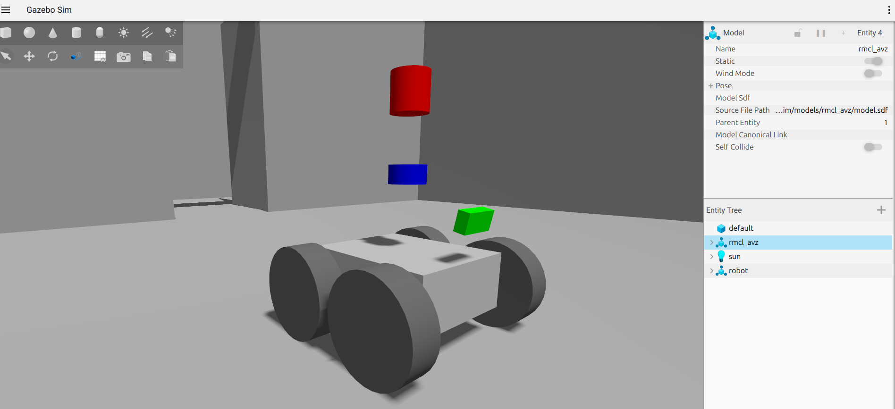
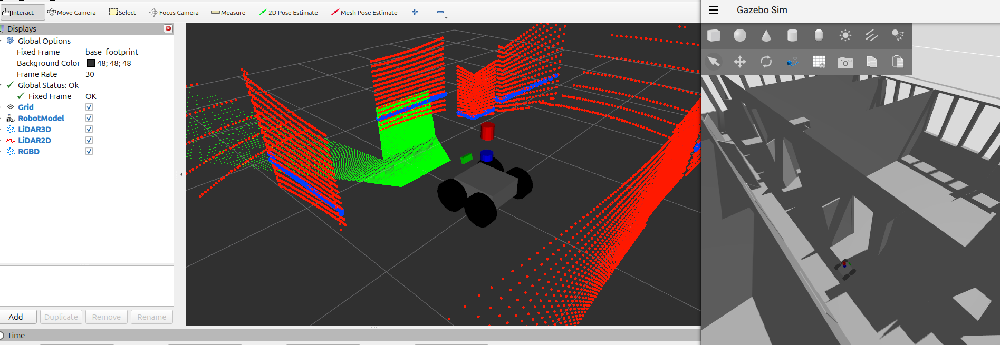
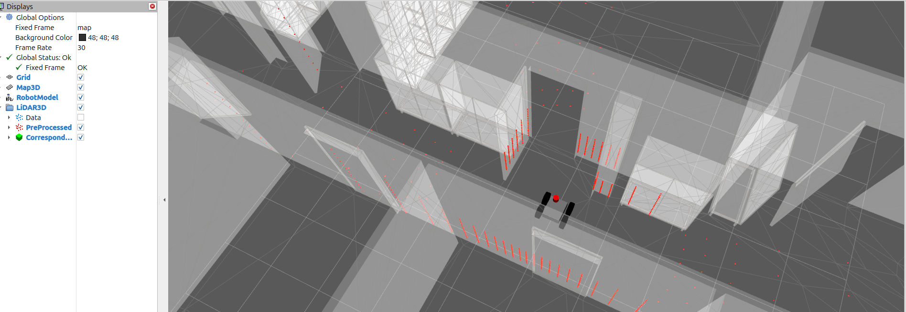
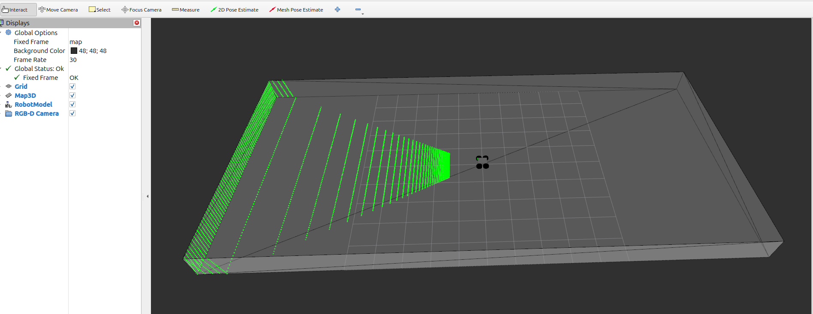

# MICP-L Overview

Three sensors, four wheels, and many worlds.


See all options:
```console
ros2 launch rmcl_examples_sim start_robot_launch.py -s
```

In the following example we vary the three parameters `lidar3d`, `lidar2d`, `rgbd_camera` to enable certain sensors and `map` to select a world.

First, we want to see how each sensor data looks like. So we enable every sensor and select, eg, the `avz` world:

```console
ros2 launch rmcl_examples_sim start_robot_launch.py lidar3d:=True lidar2d:=True rgbd_camera:=True map:=avz
```



In the opened window of Gazebo, you see a simple differential drive robot that represents a virtual clone of a [Ceres](https://github.com/uos/ceres_robot) robot (Volksbot platform). The robot is spawned in the AVZ world. This world also exists in reality, its an office floor located in Osnabrück, Germany. In addition you see three sensors (Rayman-like) attached to the robot, colored in red, blue, and green.

With RViz you can visualize the sensor data of all three sensors:
```console
ros2 launch rmcl_examples_micpl rmcl_rviz_sensors.launch
```



The sensors `lidar3d`, `lidar2d`, and `rgbd_camera` and the corresponding sensor data is colored in red, blue, and green, respectively. 

|    Sensor     | Color |   Description |  Real Sensor | 
|:-------------|:---|:--------|:-----------|
| `lidar3d`     | Red | 16 scan layers (vertical). 440 points per scan layer (horizontal). Spherical scanning pattern. 360° field of view. 10 Hz. | Velodyne VLP-16 (Puck) |
| `lidar2d`     | Green | 1 scan layer (vertical). 270 points per scan. 270° horizontal field of view. 15 Hz. | Sick Tim |
| `rgbd_camera` | Blue  | A depth camera which has 320x240 pixels (width x height). Pinhole sensor model. 30 Hz. | Asus Xtion |

For more info about the simulation we refer to the simulation package, [rmcl_examples_sim](/rmcl_examples_sim/).

## MICP-L

Now we want to localize the robot continuously relative to a map using the MICP-L method.

### 3D LiDAR

Start the simulation with only the LiDAR enabled:

```console
ros2 launch rmcl_examples_sim start_robot_launch.py lidar3d:=True lidar2d:=False rgbd_camera:=False map:=avz
```

Start MICP-L via

```console
ros2 launch rmcl_examples_micpl rmcl_micpl_lidar3d.launch map:=avz gui:=True
```

an RViz window opens



Now you can provide new pose guesses using the `2D Pose Estimate` or `Mesh Pose Estimate` tool from the tools panel on top.
The correspondences are visualized as marker gray-ish hair.

### Depth Camera

Start the simulated robot and enable only the RGB-D camera.

```console
ros2 launch rmcl_examples_sim start_robot_launch.py lidar3d:=False lidar2d:=False rgbd_camera:=True map:=tray
```

Start the following launch file

```console
ros2 launch rmcl_examples_micpl rmcl_micpl_depth.launch gui:=True
```




- MICP-L uses a filtered version of the RGB-D camera (`RGB-D Camera/PreProcessed`). Visualize the original point cloud by enabling `RGB-D Camera/Data`.
- Teleop the robot


### 2D LiDAR


### Wheels


## Worlds
