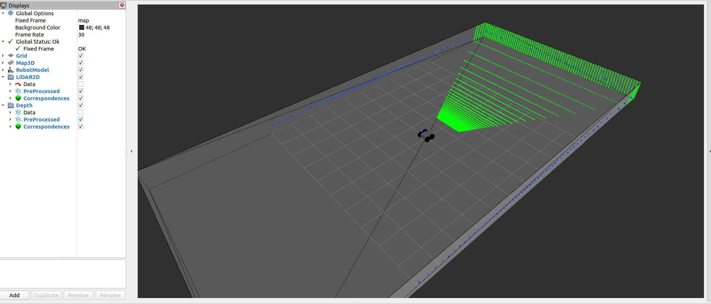

# MICP-L Sensor Combinations


## Depth Camera and 2D LiDAR

Sometimes your robot might be equipped with a depth camera and a 2D LiDAR. This example shows how to combine the information from both range sensors for localization. Run:

```console
ros2 launch rmcl_examples_sim start_robot_launch.py lidar2d:=True rgbd_camera:=True lidar3d:=False map:=tray
```

Then start MICP-L with:

```console
ros2 launch rmcl_examples_micpl_combinations depth_and_lidar2d.launch map:=tray
```

The following RViz window will open:



When setting a pose guess, you will notice correspondences drawn from both sensors.

## 2D LiDAR and Wheels

This example shows how to fuse the information that the robot must remain grounded with data from a 2D LiDAR:


```console
ros2 launch rmcl_examples_sim start_robot_launch.py lidar2d:=True rgbd_camera:=False lidar3d:=False map:=tray
```

Start MICP-L with:

```console
ros2 launch rmcl_examples_micpl_combinations lidar2d_and_wheels.launch map:=tray
```

An RViz window will open. In contrast to the `depth_and_lidar2d` example, the depth camera is omitted. Instead, correspondences from the wheels to the map are drawn alongside the 2D LiDAR correspondences.


> [!NOTE]
> By combining the wheel and 2D LiDAR data, we effectively create a kind of 3D sensing system. 
> However, in practice, I strongly recommend using a dedicated 3D sensor instead.

