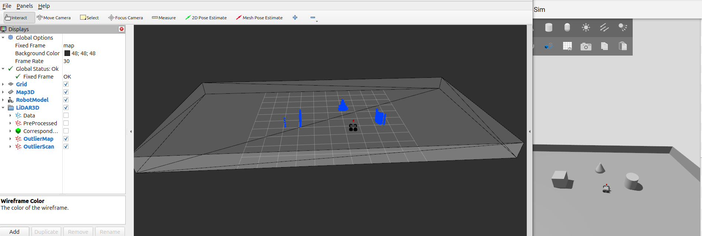

# MICP-L Segmentation

In SLAM, a robot continuously gathers environmental data to build a map.
Once a map exists, it serves as a prior: the robot can predict expected sensor readings at known locations.
By comparing these predictions with actual measurements, the robot can identify unexpected data and infer which parts of the map are implausible.
This enables segmentation of both unexpected observations and inconsistent regions of the map.

This package gives an overview over nodes that are implemented the beforementioned segmention procedure.


Start the robot by 

```console
ros2 launch rmcl_examples_sim start_robot_launch.py lidar3d:=True map:=tray
```

Place some additional dynamic obstacles around the robot in the world.
Then start the localization, plus segmentation node via

```console
ros2 launch rmcl_examples_micpl_segmentation segment_lidar3d.launch map:=tray
```



You can see all the dynamic obstacles segmented in blue. Additionally, you would see points where the scanner scan through the map colored in red. This occurs, when the map becomes invalid, eg, when a door is opened. See an example in real world here: [Video](https://www.youtube.com/watch?v=9i3B1ayvMn4&t=307s).