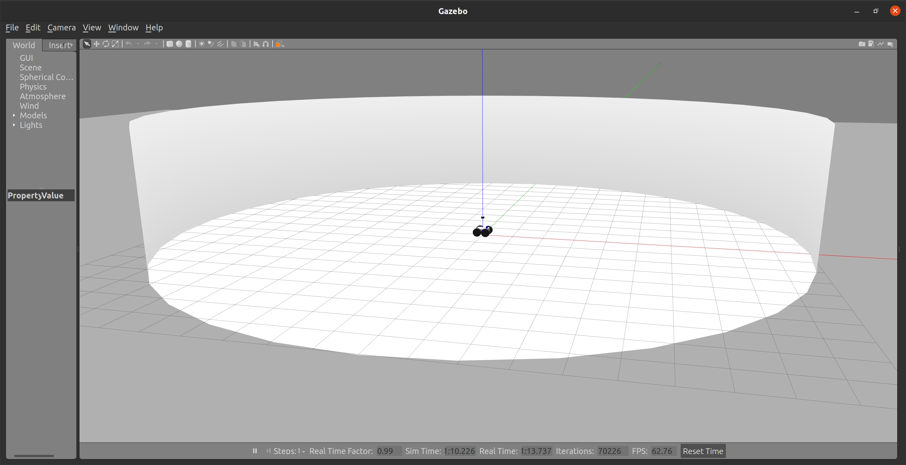

# rmcl_examples_sim

This package contains all simulation environments for [rmcl_examples](/).

## Worlds

The worlds `cube`, `sphere`, `cylinder`, and `tray` look as follows:

|    |   |
|:--------:|:------:|
| `cube`  | `sphere` |
|  |  |
| `cylinder` | `tray` |
|  |  |

There are more worlds. To list all available worlds enter:

```console
ros2 launch rmcl_examples_sim start_robot.launch -s
```

Start Gazebo with a selected world by using the `map` argument as follows.

```console
ros2 launch rmcl_examples_sim start_robot.launch map:=tray
```

This command loads the `tray` world and spawns a robot in it.

All environments are designed to benchmark localization algorithms, each posing a unique and challenging problem.
Most of these environments are intentionally constructed to prevent unique localization solutions.
Instead, the objective is to achieve the best possible reduction of the belief state informed by the sensor data.
A localization method is considered to fail if it produces a single definitive solution when multiple locations are equally probable.
The following table briefly summarize the best possible localization outcome for a robot equipped with motor encoders, an IMU and a 3D LiDAR:

|  World Name | Best possible localization |
|:------------|:-------------------------------------------------------|
|  `cube`     | 4 modes in your belief state probability distribution  |
|  `sphere`   | Equal probabilty for every pose located on the surface |
|  `cylinder` | Circular probability distribution |
|  `tray`     | Similar to cube but rectengular: 2 most probable modes. Dependent on the system and sensor noise, two more slightly less probable modes could exist. |
|  `corridor` | State: anywhere in the center of the corridor. Belief state: same probability everywhere in the center of the corridor |
|  `trays`    | 3x3 grid of `tray` model. Same most probable modes as for the `tray` environment but symmetrically distributed over a 3x3 grid. |
|  `avz`      | Old office floor of Osnabrück University in the AVZ building. Real world sample, still many ambiguities such as same sized rooms. |

## Robot & Sensors

In the opened window of Gazebo, you see a simple differential drive robot that represents a virtual clone of a [Ceres](https://github.com/uos/ceres_robot) robot (Volksbot platform). 


Furthermore this simulation supports the use of three different range sensors, a 3D LiDAR, a 2D LiDAR, and a RGB-D camera.

You can enable or disable any of those sensors via the command line.
For example, you can enable all of them by calling

```console
ros2 launch rmcl_examples_sim start_robot_launch.py lidar3d:=True lidar2d:=True rgbd_camera:=True map:=avz
```


In the opened Gazebo window you see the three sensors (Rayman-like) attached to the robot.
The sensors `lidar3d`, `lidar2d`, and `rgbd_camera` and the corresponding sensor data is colored in red, blue, and green, respectively. 

The sensors write data on topics. You can open RViz to find and visualize the topics. Or open a preconfigured RViz windows via

```console
ros2 launch rmcl_examples_micpl rmcl_rviz_sensors.launch
```


